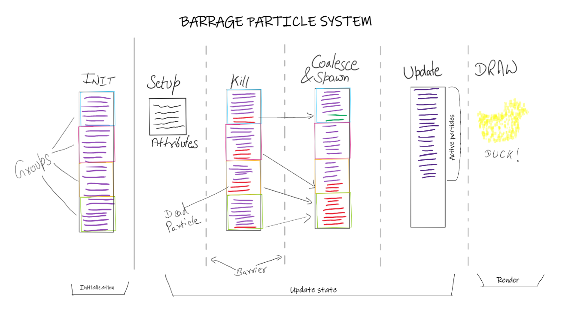
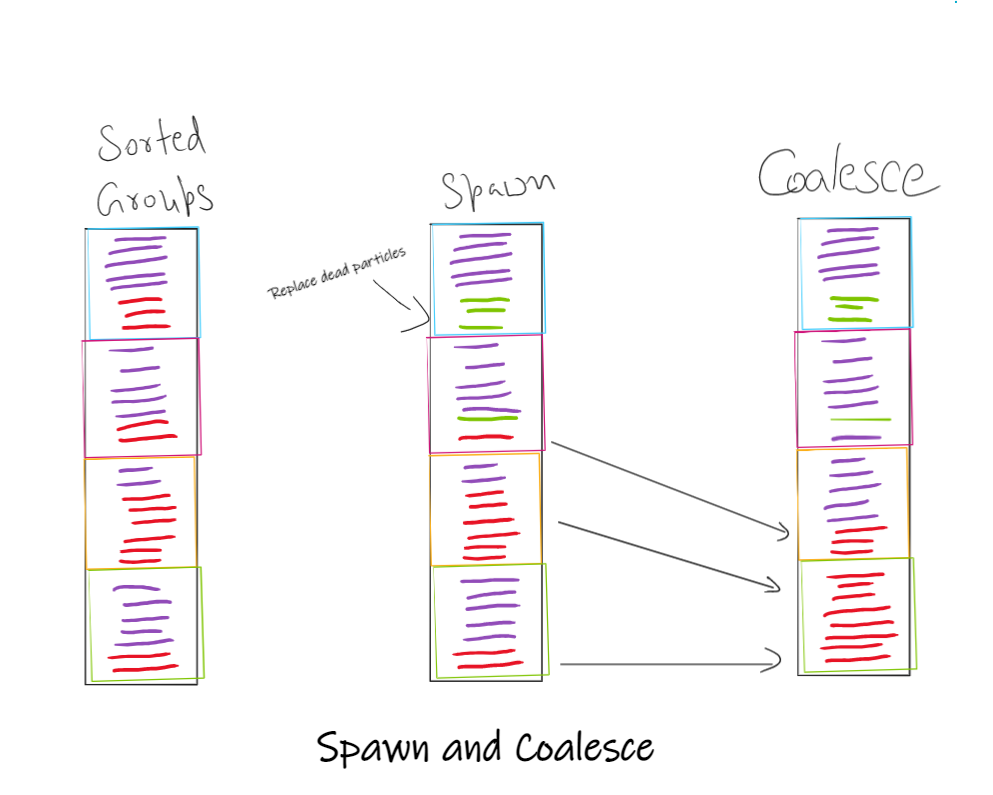
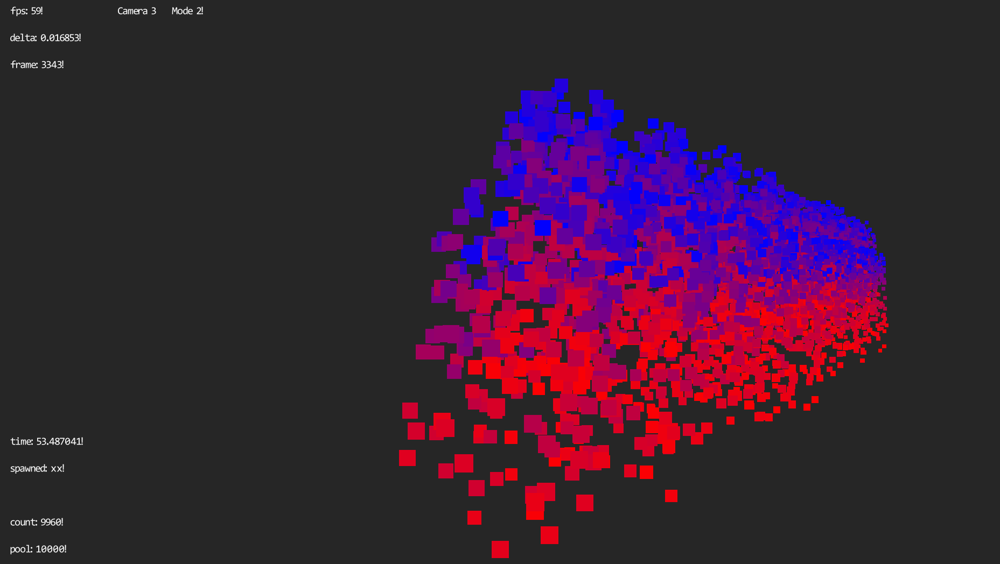
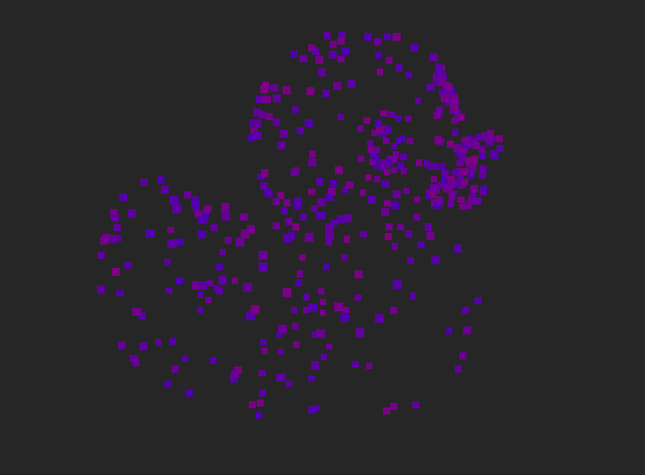

# Barrage Particle System Research 

## Description and Inspiration

<center>
</img>
</center>

During my last research I made Volley Particles which was a versatile, flexible particle system running on CPU but now Barrage Particle System is all computed on GPU with Compute shaders.
Both of them were made on OpenGL Engine that I made over the academic years but with different use cases in mind.

Barrage was inspired by Particle System in God of War(2018) which is capable of simulating a mesh slowly disintegrating into particles. It is done by using a mesh's vertices as spawn point and maybe even interpolate between close by vertices to spawn particles on the mesh surface while fading away the Mesh itself so it appears to be replaced with particles.

To pass the effect as believable, particle color is matches with the texture of the mesh at that exact location using UVs and texture.

## Usage

How to add a new Particle Controller is pretty straightforward and easy. Once `BarrageSystem` is set up with its `Create()`, `Update(delta)` and, `Destroy()` functions, all that needs to be done is add a new `BarrageController` Object to `BarrageSystem`.

`BarrageController` needs a `ControllerAttributes` object holds the attributes needed to update the particles and other meta data.

`ControllerAttributes` are set and passed to `BarrageController` object along with `spawningMesh` and texture used for the mesh object.

now the new particle system in shape of the passed `spawningMesh` should render on the screen.

## Structure and Data
- Make a UML 

BarrageGraphicsObject is the core where most action happens on the CPU side since it's the one that sets up and launches all the compute shaders.
Compute shader SSBOs(Shader Storage Buffer Objects) are created in `SetupCompute()` function where GPU memory is allocated to the different buffers.

- `ParticleInfo` : Particle buffer array
- `ControllerAttributes` : shared attributes of all particles
- `ControllerState` : Particle Controller frame state
- `ParticleGroupStat` : group info array

``` c++
struct ControllerAttributes : public Align16		// binding 1
	{
		int maxParticles;   //Max Number of particles

		// Particle attributes
		Vect gravity;       //gravity for particles
		float dampening;    //velocity dampening. 1 means no dampening.
		int spawnRate;      //Spawn rate of particles per step
		float minLifeTime;  //lifeTime of the particle.
		float maxLifeTime;  //is not being used..
		float minScale;     //starting scale.
		float maxScale;     //ending scale to interpolate towards.
		
        //not being used since I pick colors off texture.
        Vect startColor;    //starting color.
		Vect endColor;      //final color to interpolate towards.

		float meshScale;    //scale of the spawning mesh

        //No need to set this one manually.
		int meshVertCount;  //number of verts in the spawning mesh.
	};
```

``` c++
	struct ControllerState : public Align16		// binding 2
	{
		float currTime;             //currTime of Barrage System
		float delta;                //Delta of this frame. can be constant.
		Matrix worldPos;            //world position of the controller.

		int randSeed;               //random seed
		bool spawnEnabled;          //particles spawning enabled flag.

        //vertex shader optimization
		Matrix PVW_mat;             //Proj x View x World matrix
		Matrix particleInverse_mat; // inverse view Matrix

		int totalActiveParticles;   //total number of active particles
        //groups info
		int groupCount;             //number of total groups
		int groupSize;              //number of particles per group./
	};
```

`ControllerAttributes` and `ControllerStats` are allocated in CPU memory and copied to GPU while other the arrays are passed in as `nullptr` to the ssbo allocation instead.(In background it still does allocated memory before copying it to video memory.) 

The attributes are binded to Compute shaders at same binding locations so they are all shared among all the shaders.
when updated in 1 shader, the next shader can access the data or update it from there.

while `ssbo_mVerts` and `ssbo_mUVs` binds the address of respective VBO's from the `spawnerMesh`. instead of allocating new buffer memory on GPU using code below:

``` c++
glBindBufferBase(GL_SHADER_STORAGE_BUFFER, ssboBindingIndex, vbo_address);
```

## Compute Shaders

Most time spent was in Shaders themselves with evolving logics and debugging issues. what I settled at the end were 4 stages of Compute shaders which are a little too much and can be combined together perhaps, but divides the work into discrete steps.

<center>
</img>
</center>

### **Init**
Only called once per `ParticleController`, Init Compute resets the particle buffer to some default values and is dispatched based on number of particles.

It can easily be ommited if we pass in default particle data from CPU when copying into video(GPU) memory. but if we do the init on GPU, we can access `spawnedMesh` verts and set a starting position on the mesh and color off of the mesh and texture.
It makes it easier to debug if particles are being updated correctly by changing default color to a specific one if needed without having to recompile the solution.

### **SetUp**

SetUp Compute is used to set all the current frame values to the SSBOs so next stages can use them and to calculate the PVW matrix so it doesn't need to be computed for every single vertex of every particle being rendered.

It's only dispatched on single thread but it barely does any work as well, so it's not really a bottleneck except it calls the whole pipeline multiple times due to getLocation that can be cached since the locations never changes. can be easily optimized but the complexity is constant so it doesn't depend on the number of particles.

`glCopyBufferSubData` can be used to write into SSBOs directly but I ran out of time before able to implement and try them so I used uniforms to read data from CPU instead. glCopyData could be faster since CPU can handle single-threaded tasks and it can be done in 1 single pipeline call.


### **Killer**
Killer gets called on groupCount number of threads in parallel and finds the particles with lifetime expired within the group and moves them to the bottom, passing on sorted groups to the next stages.

it updates the `numberOfActiveParticles` in each group to new values based on how many particles died.

> It could also spawn particles using atomic operations to keep track of total particles but it was too late to refactor.

### **Coalescer**

Coalesce Compute shader handles 2 responsibilities:
1. It spawns new particles by filling the empty dead spaces in the groups starting from top first.
2. Coalesce the rest of groups together so all the active particles are on top of the `particleBuffer`

<center>
</img>
</center>

It is the slowest part of the process given it runs in single thread and has Big O complexity depending on number of groups x number of alive particles at bottom.

using atomic opeations or merge sort, this could have been optimized to compute in parralel as well but for now it stays as the bottleneck.

### **Update**
Update is where active particles are updated to new position, color, velocity and so on based on ControllerAttributes and stats.

It is dispatched maxParticles number of times. nothing special about this, more logic could be added here to make the particles act differently.

## DrawInstanced.

DrawInstanced() is called after the particles are Updated. to get the instance count, after the coalesce stage of the shader, `ControllerAttributes` is mapped back to CPU to read the number of Active particles before unmapping. it is slow method but it's still not particle count dependent so I didn't mind much. 

<center>
</img>
</center>

## Challenges

__**1. Sorting the alive particles**__

We know GPUs are great at doing tasks concurrently on thousands of cores. which makes the sorting algorithm I use a huge bottleneck since it runs on single thread of GPU, which usually runs slower clock speed than CPU.

but if I don't want to render all the dead particles, I need the instanced Draw to have all the particles contiguoursly in memory. which requires me to sort all the alive ones on top of the buffer.

Due to time constraints, it was too late to change the algorithm or to test different ways to implement the particle sorting.

__**2. Debug SSBO values**__

Debugging the Shaders is comparitively harder than C++ code since we can't do breakpoints to test the execution in steps, or even print anything on the console, so I usually mapped whole buffers back to CPU side and would breakpoint or print the value there to test execution and values.

**__3. Profiling optimization__**

I tried working with RenderDoc and Intel VTune but the data didn't help me much due to time constraints, I could only make it work. I'll be adding more to this system and optimize it enough to be usable!


<center>
</img>
</center>

## Possible Optimizations

### Release Mode
I've only tested this system in debug mode and not in release due to missing library release build. Release mode may not help much apparently since CPU is barely a bottleneck for this system.

### Sorting algorithm
Merge sort can be done in parallel and would be a great way to sort the particles in coalesce part. perfect for GPU.


<center>
</img>
</center>

> Above image: It's rendering duck but adding a position offset based on group number, rendering 10 ducks side to side.


### IndirectDrawInstanced
DrawInstance is faster than simple Draw call but I'm still mapping number of active particles to read a value from GPU onto the CPU.
with gl_IndirectDrawInstanced I could call DrawInstanced command from GPU itself with draw attributes already living on GPU.

### glCopyBufferSubData
Instead of using uniforms, glCopyBufferSubData could be used to write in whole buffers in 1 GPU call, saving time to set uniforms and dispatching a ComputeShader.

## Future Addons

I'd love to add these all optimizations since they are all very doable but the Research's vision wasn't completed either. I'd like to make the particles be able to spawn at a location on mesh based off a Texture Map.

the same texture Map could be used to fade the original mesh so it would complete the illusion of mesh turning into particles.


<center>
</img>
</center>

## Final Words

There's still so much I could have improved and added but it was a great experience anyways. I do feel I could have done much better but I couldn’t give this as much time I wanted to. I learned a lot about Compute shaders and how to share and process data with them. I’d love to continue working on this research since I may have more time available for a while since I’m graduating.

Thanks to my professor Edward Keenan who provided me with all the precious knowledge of Compute shaders and made me jump into this whole new GPU world!

---

---