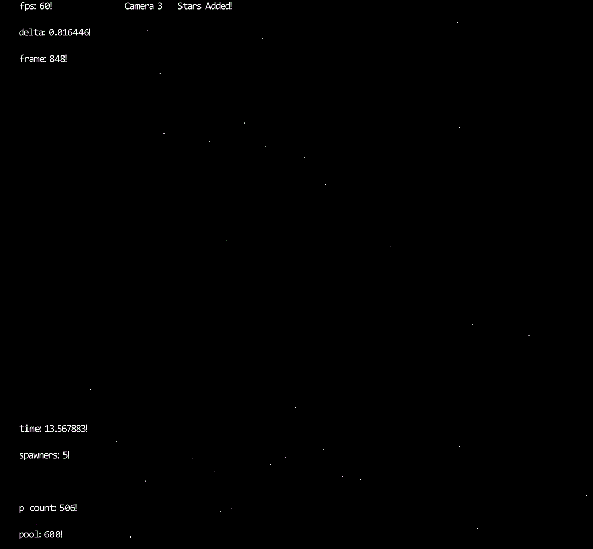
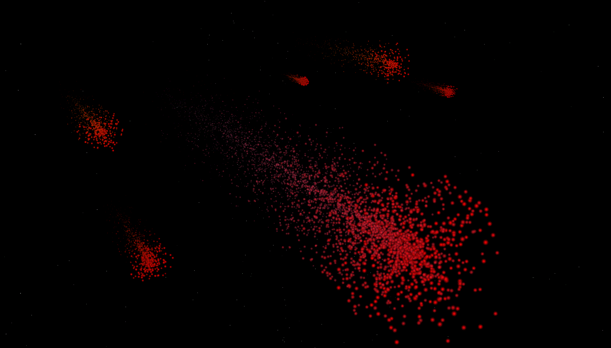
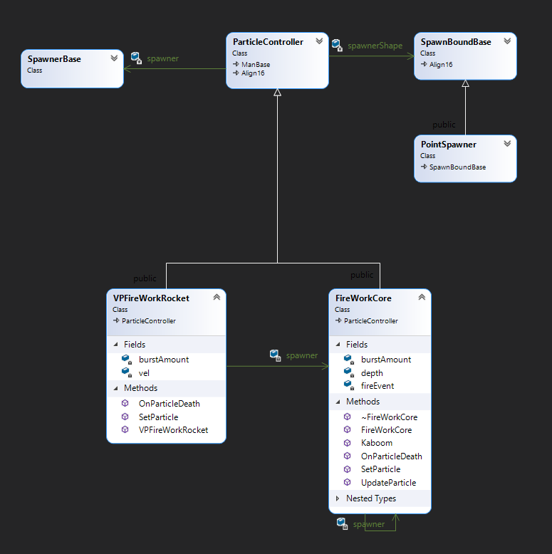
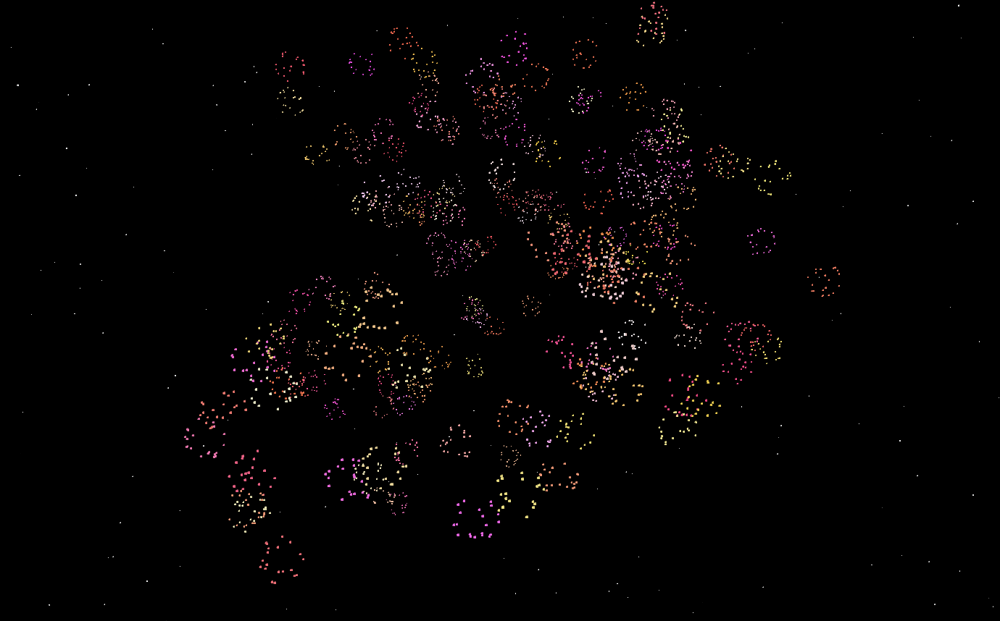

# Volley Particle System Research

## **Introduction**

The research plan was to create a designer friendly flexible realtime particle system library to achieve unique desired effects with minimum extra code. I assumed challenge would be to optimize it to the point where I could render thousands of particles without frame drop, but it all shifted more towards making it more dynamic and easily customizable while keeping the code open for future extensions.

Results can look like this:
 
<center>
</img>
</center>

or like this:
<center>
</img>
</center>
Notice, all the particles are processed on CPU and then rendered using OpenGL draw calls(on GPU of course). I stopped trying to optimize it once it was apparent that reducing the draw calls was the only way to improve the performance, and I'll talk about a way to do that in "What could have been done" section ahead.

## **Basics**

Let me just discuss about what it can do before going into the details on how it is done. To make it simpler, I'll just divide the whole process of rendering particles into 3 simple steps:
1. Initialize
2. Update
3. Draw

### **1. Initialize**

First and most useful step for Users where we just setup the system to our liking depending on what we are aiming for. This step is all about setting variables, components for the `Particle Controller` and writing new logic(override function) if a custom behavior is needed.

There are 2 different types of attributes that does affect every particle, they can either be shared ones or per-particle ones.
shared ones exists in `ParticleController` class object which manages the particles of the instance, and each particle holds it's own unique data like position and current color.

__Shared attributes__ 
|Attribute|Description|
|:--|--|
|world position |Origin for all the particles of the controller. can control if particles should follow the origin or be independent of the spawn position|
|currTime   | Current Time of the particle System.|
|gravity    | Vector defining the direction particles should accelerate toward.|
|color      | A VVect class which can be overridden to interpolate between 2 colors, randomize and so on|
| lifeTime | life duration for each particle. can be a constant value or randomized within range.|
|initial velocity | velocity that's set for each particle. hard coded for now sadly.|
|Spawn Bound | provides new particles with a new position based on a shape. can be a point, sphere, cube or edges of the cube/sphere.|
|Graphics Object | holds onto shader, texture, mesh and passes info to GPU.|
|dampening| dampening factor dampens the movement of particle. 1 means no dampening.|
| spawner | spawner object takes care of spawning particles. if it's BurstSpawner object, it will spawn a fixed amount of particles at fixed interval. or you can just manually spawn!|

__Unique attributes:__ 
|Attribute | Description|
| -- | --|
| position | current position of particle|
| scale | current scale of particle. type float.|
| color | current color of particle. can change over time.|
| currLifeTime | life remaining before particle dies. |
| startLifeTime | life starts from this value and then moves toward 0. needed to calculate normalized life.|
| velocity | current velocity of the particle. after taking gravity into account.|

Setting up a Simple star field to render stars far away from camera in all direction looks like this.
```
//Stars
		ParticleController* starField = new ParticleController();

		starField->SetController(
			*(new P_Graphics_Sprite(pSpriteMesh, pVShaderObject_sprite, defaultParticleImage, Rect(100, 100, 20, 20))),
			new SphereEdgeSpawnShape(80),
			new BurstSpawner(0.1f, 10)
		);
		VolleySystem::Add(starField);
		starField->SetLifeTimeRange(3, 7);
		starField->SetWorldPosition(Vect(0.0f, 0.0f, 0.0f));
		starField->SetGravity(Vect(0, 0.0f, 0.0f));
		starField->SetColor(Vect(1, 1, 1, 1));
		starField->SetScale(0.3f, 0.02f);
```

<center>
<table>
<th>
</img>
</th>
<td width="300">

Above code spawns 2D default textured particles in all directions using sphere edge shape of radius 80. 10 new particles(stars) are spawned every 0.1 second with life between 3 to 7 seconds. No gravity and origin is in center of world.
scale is interpolated from 0.3f to 0.02f over their individual lifeTime.

</td>
</table>
</center>


> Scale could be interpolated with sin wave for better fade in and out transition and isn't that hard to do by adding a new `VSinRangedFloat` that returns sin waved value, or by simply overriding the class `UpdateParticle()` function and manually change the scale with sin, which we gonna see an example of next.

Second step of the Initialization would be overriding some functionality to change behavior of the system. it is pretty straight forward, as you can easily inherit from `ParticleController` Class and override the functions as needed.
*For example:*
```
void FireWorkCore::UpdateParticle(Particle& particle, const float normTime) const
{
	const float minAlpha=0.5f;
	particle.currScale = scale->GetValue() * sinf((normTime < minAlpha ? minAlpha : normTime) * 3.14159f);
	particle.color.w() = sinf((normTime < minAlpha? minAlpha : normTime) * 3.14159f);
}

```
above code changes the scale and color.alpha of particle over it's lifeTime with a sin wave starting from 50%.(or I could do cos from 0 to 0.5f. same thing.)

So just like that, we can control particles from the controller. there are more functions that can be overridden to give more flexibility to the designer.

> You can easily create a sub-Particles spawning system once the particle is dead by overriding `OnParticleDeath()` function. I created some fireworks to test that!

---

### **2. Update Loop**

`VolleySystem` class holds a list of all the `ParticleController` to Update, Draw and Clean up itself. Update happens in 3 parts:


- **Update Attributes(optional):** it is optional but you can change the attributes before updating particles like new color, gravity change, translate the particle origin etc.
> only translate please, billboard maths needs some work for rotation.

- **Update existing particles:** calls Update on each particle and kill(add to pool) it if its `life time` expires.

- **Spawn new particles:** final step is to spawn new particles based on spawn attributes like `burstAmount`, `spawnRate`, `delta`(why delta? will discuss later in *Challenges*) etc. New particles don't need to be updated since they are Updated to current state in the creation function.

### **3. Draw**
Draw is handles by `VolleySystem` class automatically which keeps track of all the active controllers. or you can just call Draw Manually if you wanna go that route. No one's stopping you.

Rendering all particles is literally sending data over to GPU before drawing each particle one by one. it is also the major bottleneck of the system since GPU calls are expensive and GPU rather render a thousand triangles once than 1 triangle thousand times.

<center>
</img>
</center>

For user, Draw is not a concern and can be ignored completely.

---

## **Deep Dive**
Now we have some understanding of what it is so lets jump into the deep end and see what's happening behind the scene.

### **Architecture**
Major part of the system is the architecture, that not only renders all the particles efficiently but also keeps the code extensible and clean. The overall architecture of the system is as this UML:

<center>
</img>
</center>

`ParticleController` keeps a list of `particle` data and handles the pooling(since we don't want to keep deleting them and creating new particles over and over, efficiency is not a priority but still important). User can easily change particle attributes while creating a new `Controller` or change them later using helper functions.

> Of course there are plenty of things I can think of to improve and add some quality of life updates but with given time constraint, this is the best I could come up with.

### **Component Based**
`SpawnBoundBase`, `SpawnerBase`, `VVect` and `VFloat` are all base component classes for `ParticleController` and can be replaced with one of the inherited class, giving it a `command pattern` structure for composition over inheritance.

**`SpawnBoundBase`** provides controller with positions to spawn particles at. it can be a single point with `PointSpawner`, a cube or sphere with `CubeSpawner` and `CircleSpawner`(don't know why it's not SphereSpawner). or just positions at the edges of these shapes. 
with Component based design, it's really easy to add more shapes, more ways to spawn, color and scale transitions and so on.

<center>
</img>
</center>

**`SpawnerBase`** class handles the spawning of particle bursts and does not spawn anything is an instance base class itself is passed to `ParticleController`, letting user manually spawn particles instead, while `BurstSpawner` overrides it to spawn bursts over a spawn rate automatically.


Overhead of the component based design is to add functions in `ParticleController` for each of these components in case we want to update some value in one of the component for example `SetScale()` function updates `color` variable of type `VRangedFloat`. but we can always just keep a reference to the components and update them on fly without even contacting the ParticleController. wonder if that's a bad design choice.

I talked more about `VVect` and `VFloat` later in *Maths Utilities* section.

### **Updating Particles**

Interestingly I kept working on particles considering them a realtime entity, which makes them skip the missed time between frames and predict their new data. if for some reason system takes a second to render, next frame will skip a second of duration and jump to what particles would be if system was running smoothly for a second.

In case we want particles to slow down with lags we can always just keep the delta passed to `ParticleController::Update()` as a constant value. now in case of a second long frame time, particles will just step once, as if time stopped for them as well. this will slow down the particle system along with the frame rate, so this would be more ideal for consoles where frame rate can be locked to a certain value.

### **Draw Cycle**

Drawing each particle uses **proxy design** pattern to reuses the GraphicsObject to render each particle with different configuration(color, location, scale etc). Rendering order is an issue and I've talked more about that in **Challenges** section. for now I keep the blend mode to blend together and writing to `Depth buffer` is disabled so one group of particles are rendered on 1 flat plane considering they don't write to depth buffer and will not sort while being rendered. 
On the contrary, different groups will render based on the draw order, so they might draw over particles which are in front of other particles.

```
// In ParticleController
void Volley::ParticleController::Draw() {
	//draw all the active Particles.
	Iterator* i = baseGetActiveIterator();
	gObject->SetState();            //Prepare the Rendering state
	gObject->SetCameraGPU();        //Send over the shared data like camera and origin.
	
	for (i->First(); !i->IsDone(); i->Next())
	{
		static_cast<Particle*>(i->Curr())->Draw(gObject);       //Draw each particle, sending their unique data over to GPU.
	}
	gObject->RestoreState();        //Reset state.
}

// In Particle.cpp
void Volley::Particle::Draw(ParticleGraphicsObject* graphics) {
	graphics->SetPosition(currLocalPosition); 
	graphics->SetScale(currScale);
	graphics->SetColor(color);
	graphics->SetParticleDataGPU();     //Load everything to the GPU once they are set.
	graphics->Draw();                   //Draw the triangles. Note: Quads are deprecated!
}
```
 
This explains the whole Draw cycle logic very neatly. Let me just reveal the `SetState()`:
```
    glFrontFace(GL_CW);
    glDepthMask(GL_FALSE);  //Avoid depth testing, we don't care about particle's z-value/depth.
    glEnable(GL_BLEND);  // Blends them with given function below
    glBlendFunc(GL_SRC_ALPHA,GL_ONE_MINUS_SRC_ALPHA);
```

> For texture one, it also needs to `glBindTexture` of course.

<center>
</img>
</center>
> That was a lot of code, have this companion cube for support. please take care of it.

### **Maths Utilities**
I added strategy classes for both float and Vect class so they could be swapped for different implementations like `VVect` is just a vector of 4 floats while `VRangedVect` holds 2 more `Vect` for minimum and maximum range which can be interpolated from min to max, randomized between range and so on.

Idea was to let users add some controlled randomized values for `scale`, `life time`, `velocity` or `color`.

Here's how ranged float functions are set up with some bridge functions in `ParticleController` to handle scale.
```
void Volley::ParticleController::SetScale(const float start, const float end) {
	if (scale != nullptr) {
		delete scale;       //making sure it's not already been set to something. yes it's expensive to change scale type with these functions at least.
	}
	scale = new VRangedFloat(start, start, end);    //default value is set to start.
}

void Volley::ParticleController::SetScale(const float _scale) {
	if (scale != nullptr) {
		delete scale;
	}
	scale = new VFloat(_scale);
}
```

And it's really easy to alter the behavior by calling one of the functions in `UpdateParticle()` Function as follows.

To Randomize color for every new particle:
```
void FireWorkCore::SetParticle(Particle* const particle, float delta)
{
	particle->currLocalPosition = spawnerShape->GetRelativeParticlePosition();
	particle->color = color->RandomizeInRange();   //Gives a random value between min and max values set.

	particle->Set(lifeTime->GetValue(), delta, Vect(0,1,0), 0.0f, *this);
}
```

while to Linearly interpolate from min color to max:

```
void Example::UpdateParticle(Particle& particle, const float normTime) const
{
	particle.color = color->InterpolateTo(normTime);
}
```

> Notice these are being called in different overridden functions. First one is called upon every time a particle is spawned, and second one every update for each particle.


### **FireWork Example**

<center>
</img>
</center>

Overriding the functions of `ParticleController` gives us a lot more freedom with what we want to do with particles and FireWorks are a good example of `sub-particles`. overriding `OnParticleDeath()` lets us spawn new particles for every particle death using other controllers.

> you can use same controller but that will recursively create particles on every particle death, which is fun but will eventually slow down whole system. I tried, was worth it.

```
void FireWorkCore::OnParticleDeath(const Vect& position, const float delta)
{
	fireEvent->Execute(*this, position, delta);
}
```
`FireworkCore` calls an event whenever particle dies and only thing that event does is call `Kaboom()` function on a new `FireWorkCore` instance.

```
void FireWorkCore::Kaboom(const Vect& pos, const float delta) const
{
	if (rand() % 2 == 0) return;		//50% chance of spawning a burst. otherwise it's too much.
	spawner->color->RandomizeInRange();
	spawner->SetRelativeMovement(false);
	spawner->SetWorldPosition(pos);
	spawner->SpawnBurst(delta, burstAmount*(depth+1));
	spawner->SetScale(0.1f * depth);
}
```

I have a depth variable which decides when to stop spawning another layer of fireworks, simple logic looks like this:
```
if (repetition > 0) {
		spawner = new FireWorkCore(Vect(0, 0, 0), this->burstAmount, Vect(1, 1, 0),repetition-1);
		fireEvent = new FireFireWorkEvent();
		VolleySystem::Add(spawner);
	}
	else
		fireEvent = new Event();        //Null event, doesn't do anything.
```

<center>
</img>
</center>

> I know it looks random but I'll leave making it look pretty to designers, spent too much time on it already.


### **Shaders**

So far I have added 2 shaders but it's not that hard to add more. Both of them uses Triangle since Quads are deprecated from OpenGL 3.0 forward.

> I could use GL_Triange_Strip for a bit of performance every particle, but optimization wasn't really the goal anymore.

1 shader has texture and other is just colored square(2 triangles), and color can be changed for both of them, given the sprite will only be tinted if it isn't white.

    I actually added some 3D perlin Noise code in shaders but to alter where we want to use that noise data(for scale, position or velocity etc), we would have to update shader code manually which I wanted to avoid. not that I didn't want to deal with shaders, but it wouldn't be very flexible if shader code needed to be changed.
    I could however, just give an option to add some noise to position based on a multiplier. But some other time perhaps.

<center>
</img>
</center>

> This screenshot has some jittery movement but you can't really tell based on screenshot so idk why it's here in a pdf.

There's nothing really special about shader here as they are just a 2 triangles being rendered and/or textured, so let's move on.

<!---
---
## Major Design Patterns:

- Template Pattern for Controller overrides
- Abstract Pattern for Lists
- Command pattern for composition
- Flyweight for particles of course
- Iterator Pattern
- Object pooling
-->

---
## **Challenges**
### Frame skips/Huge Deltas:
 After few weeks in I made this discovery that for a time sensitive system, a big delta is not the issue but the aftermath is not desired. multiplying everything with delta doesn't fix things either since the problems are bigger than that:
    
- *__Missing Bursts:__* if a `frameDelta` is bigger than your `spawnRate`, you might miss number of bursts which will break the immersion of your particle system. for a steady stream of particles like rain, a huge delta will cause rain to stop for a moment before carrying on.
- *__Delayed Burst:__* Sadly even if you compensate for delta and do more bursts to keep up with the missing bursts, there is still an issue that your particles are not where they were supposed to be.

> Example: Imagine a gun that shoots 30 bullets every second. which means it needs to fire a bullet every second frame. if the game is running at 30 fps, now it fires every frame. and if we go ahead and half the fps again, now it must fire twice every frame which does not make sense since now you are not able to actually fire 1 bullet anymore. hence, higher fps is better.. and something needs to be done to handle the tiny spawnRates on things.

Now that the problem is here, what's the solution? basically whenever you add a new particle, you also need to calculate its simulated position for given time. this will move your particles to right position and compensate for missing delta and there is no extra calculation other than you might be spawning way more particles in the frame after a huge delta to compensate for missing bursts.

> Another issue with this currently is when the delta is too huge, system tries to spawn all the missing bursts and kill them right there, instead of considering that some particles may already be dead before they even spawn. filling in the pool with reserved slots for extra particles which won't be needed.

### Flexibility vs Efficiency:
 Keeping things flexible was more of my goal but efficiency is also important for a particle system. Moving calculations to GPU does make it way more efficient which compute shaders will do as well, but also takes away freedom to add more functionality without adding complex harder to debug shader code. For now I did nothing special but to use Component design(Composition) to make it easier to replace parts of controllers to make them flexible.


### Sorting particles:
 draw order of the particles matters mostly when they are part of separate groups. if you have fire behind some smoke, you wouldn't wanna see the smoke. I did not have enough time to deal with this issue completely sadly. instead of sorting a group, you can Disable writing to Depth buffer so they all are considered at same depth and blend them together so there's no overlaps. but they would still draw over other groups.

> where "group" is particles spawned by same instance of `ParticleController`

---

## **Debugging**

I did add some on-screen text to keep track of some particle info for Debugging:
- current time
- number of active particles
- particle pool size
- number of particle systems active

also had some more text for performance like
- frames per second
- frame time
- total number of frames

Added functionality to `pause` the particle system by pressing 'D' key and then `step a frame` by hitting 'S' key. Since I was working on delta compensation, I added a giant `step of 1 second` when 'F' key is pressed to see if particles play as expected under slower frames.

---
## **Optimization Suggestions**

1. Moving it compute shaders. Yes, that's the best way to optimize a particle system to render millions of shaders but I just wanted to get familiarized with them first. I will be creating a compute shader particle system in my next research! can't wait!

2. I am not entirely sure how well it would work in comparison, but I could try creating a new mesh of all the particle vertices every frame and then render only 1 object at end.
Since the major bottleneck is draw calls hitting graphics pipeline every particle, this solution would avoid that completely with just 1 big call to move all the mesh data every frame.

3. One way to improve some performance on CPU side would be keeping all the Particles data in 1 contiguous memory and then Update them with either 1 CPU or divide them for multiple processors.
improved caching would benefit anyways but it wouldn't solve the problem of same amount of draw calls.

4. I could move more of the particle calculation to the shaders but that would make the system more rigid so i planned not to since I wanted it to be flexible to be customized. you gain some, you lose some.

5. After a while I stopped caring about micro optimization but there's still a lot that can be improved since it's particles. every tiny optimization is improved by a factor of number of particles.
---
## **Possible Improvements**
Although it's just a simple system I did learn a lot about planning, architecture, particles and optimization. If I could do this from the scratch again or had more time to work on it I'd make these changes:

- **Animated/Flipbook sprites:** Really wanted the feature to add sprite list to scroll through for every particle. wouldn't really be hard to implement with each particle carrying an index for the frame and loop through the index on every frame. but ran out of time.
- **Custom Initial Velocity:** I have initial velocity hard coded to be randomized in the function, but I could make it a Component just like color or SpawnShape.
- **A timeStep Multiplier:** Just to make the system slow or faster based on a multiplier. very easy to implement.
- **ParticleController GameObject:** if Particle Controller was inheriting from my GameObject class, it would be much easier to move it around and add it to tree hierarchy instead of a list.
- **Perlin Noise:** a little bit of Noise makes particles much more interesting since they become more random. I can still enable noise in shader but there's no control over it from C++ yet. so adding a bridge to control the noise factor would be an interesting feature.
- **3D Particles** 3D meshes are more complex to render but since we would be sending the same amount of data over to GPU, it wouldn't be too much load for GPU to render 3D meshes instead of 2D. all it needs is replacing the GraphicsObject.
- **Trails!** My fireworks would look much better with trails. Most probably it will need to calculate the meshes every frame using `Triangle_Strips` meshes.

## **Final words**
There's still so much I could have improved and added but it was a great experience anyways. With this new insight in particle System I think I'm ready to deal with Compute shader magic to render millions of particles!
In future I won't keep the research topic to be this vast and keep it targeted at a specific topic which I could go in detail instead. But I'm happy I made this all in time and it's time to move on to next research and keep learning.
